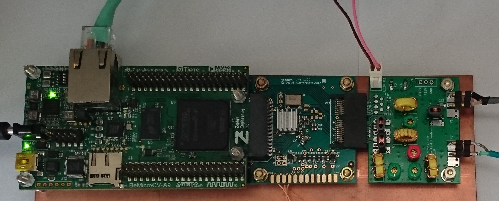
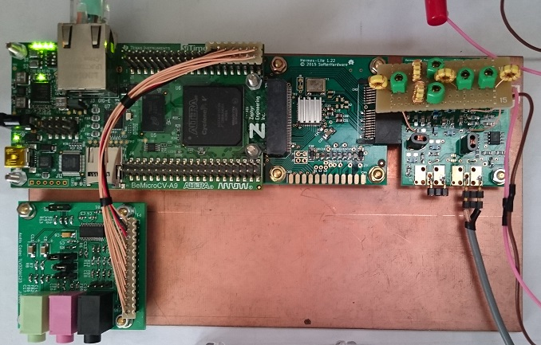

#  ji1udd Hermes-Lite Enhancement 
## 6M Frontend using undersampling technique  
Hermes-Lite v1.22 covers HF all bands.
Its sampling frequency(Fs) is 73.728MHz and the first nyquist zone is under 36.764MHz.
Hermes-Lite is a good performance system, but It does not support 6M band. 
I thought whether Hermes-Lite could be used on 6M band by using undersampling technique, without a transverter. 
But I have never seen any undersampling transmitters and transcevers.
I made 6M Test Frontend board for the performance test and to realized it. 

  

[_Schematic_](6M-Band/frontend_6M_v100/docs/frontend6m.pdf)
[_BOM_](6M-Band/frontend_6M_v100/docs/BOM_Frontend6m.pdf)
[_Gerber_](6M-Band/frontend_6M_v100/gerber/frontend6.zip)
[_Gerber-ReadMe_](6M-Band/frontend_6M_v100/gerber/ReadMe.txt)  
[_PCB Errata and filter adjustment_](6M-Band/frontend_6M_v100/docs/Frontend6m_v1.0_PCB_Errata_and_FilterAdjustment.pdf)

I got very good result. Here is the output power and IMD3 of 6M Test Frontend. 

This application takes advantage of 1st image signal ( Fs-Ftx ). 
Therefore, AD9866 interpolation should be off (1x).   

Other unnecessary spurs (e.g. 2Ftx) should be care.
In case of Hermes-Lite v1.22,  Fs is 73.728MHz. 2Ftx is out of 6M band. 2Ftx spur can be rejected by BPF perfectly.  

If Fs is 76.8MHz (Hermes-Lite v2 will use), 2Fx is in-band. 
It might be weak (<-65dBc) according to the current result.
But Fs=76.8MHz settign is not suitable for 6M.  

For more detail, refer to [_6M Support thread_](https://groups.google.com/forum/#!topic/hermes-lite/oetsCIdmZzY).

## Frontend v1.42 experiment with balanced 6M BPF.
I converted the single-ended 6M BPF that is used on 6M Frontend board to balanced-ended's in order to apply to Frontend v1.42 circuit.

I got the almost same result as 6M Frontend.

  
  
More result is [_here_.](6M-Band/frontend_v142_with_6M_filter/docs/6m_Spur_v142_and_orignal.pdf)

## Undersampling 6M transceiver (World's 1st?)
I made 6M transceiver using 6M Frontend. I added my new 6M power amplifier board. Its output power is 3W in CW.
In SSB mode, the output power should be kept under 1W for good IMD3 (under -35dBc) by adjusting Drive Level (TxPGA).
Rx Pre Amplifier on the schematic is not needed by adjusting AD9866 RxPGA.

  
[_Schematic_](6M-Band/PA_6M/docs/6mPA_v1.01.pdf)
[_BOM_](6M-Band/PA_6M/docs/BOM_6m_PA.pdf)
[_Gerber_] (6M-Band/PA_6M/gerber/amp6.zip)

## Audio Codec
As I have a sound trouble when PowerSDR VAC is used on my Windows8.1 PC, I added an external audio codec as a solid countermeasure.  
I got the audio codec information from [_ik1xpv web site_](http://www.steila.com/blog/index.php?controller=post&action=view&id_post=4).

  

[_Schematic_](audiocodec/docs/AudioCodec_v1.0.pdf)  
[_BOM_](audiocodec/docs/BOM_Keyer_AudioCodec.pdf)  
[_Gerber_](audiocodec/gerber/audiocodec.zip)  
[_Audio Codec board connection CVA9_](audiocodec/docs/Connector_Assignment_BeMicroCVA9_Keyer_AudioCodec.pdf)  
[_Mic jack jumper setting_](audiocodec/docs/Mic_Jack_jumper_setting.pdf)

Now, PowerSDR and piHPSDR works well with this audio codec board.

 

## Iambic keyer
I implemented  Iambic keyer functions that PowerSDR supports, except Keyer Mode-B. 
I implemented Keyer practice mode(Keyer is active, but does not transmit) instead of Mode-B. 
The keyer that I scratch built needs only 150 ALMs, 1 DSP block, 8K Byte block memory.

  

### Supported functions
- Variable Sidetone frequency :  
Sidetone is always synchronized with receiver pitch. I added two new ways of sidetone output.   
1) Square wave output for inexpensive piezo sounder.  
2) Sine wave output through an external audio codec.  
- Variable Speed control
- Others  
Keyer ON/OFF, Sidetone ON/OFF, Break in delay time, CW delay Key-Up,   
CW delay Key-Down,Reverse Paddles,Weight

[_Keyer installation diagram_](audiocodec/docs/IambicKeyer_installation_diagram.pdf)  
[_Keyer sequence and setting_](audiocodec/docs/Keyer_Sequece_and_setting.pdf)  
[_Modification of PCB (Schematic)_](audiocodec/docs/Modification_of_Audio_Codec_Board_for_keyer_schematic.pdf)  
[_Modification of PCB (photo)_](audiocodec/docs/Modification_of_Audio_Codec_Board_for_keyer.jpg)   
[_Keyer connection CVA9_](audiocodec/docs/Connector_Assignment_BeMicroCVA9_Keyer_AudioCodec.pdf)  
[_Keyer connection SDK (Not Verified Yet)_](audiocodec/docs/Connector_Assignment_BeMicroSDK_Keyer_AudioCodec.pdf)  

Verilog-HDL code was released on my git (27 July 2016).  

## Bemicro CVA9 100Base-TX connection
I modified the Hermes-Lite v1.22 firmware for connecting to Raspberry Pi / PiHPSDR directly. 

Verilog-HDL code was released on [_CVA9-100Base-TX branch_](https://github.com/ji1udd/Hermes-Lite/tree/CVA9-100Base-TX) (5 May 2017). 
